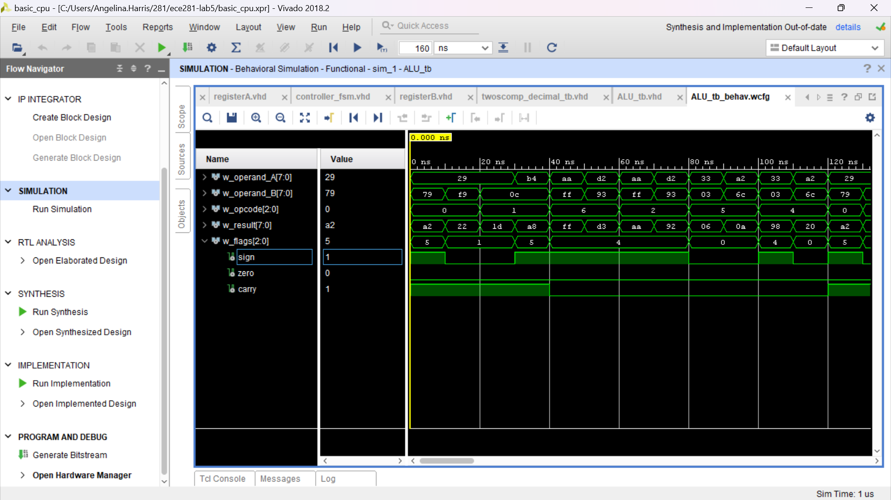

# Lab 5: Basic CPU

VHDL for ECE 281 [Lab 5](https://usafa-ece.github.io/ece281-book/lab/lab5.html)

Targeted toward Digilent Basys3. Make sure to install the [board files](https://github.com/Xilinx/XilinxBoardStore/tree/2018.2/boards/Digilent/basys3).

Tested on Windows 11.

---

## Build the project

You can simply open the `.xpr` and Vivado will do the rest!

## GitHub Actions Testbench

The workflow uses the [setup-ghdl-ci](https://github.com/ghdl/setup-ghdl-ci) GitHub action
to run a *nightly* build of [GHDL](https://ghdl.github.io/ghdl/).

The workflow uses GHDL to analyze, elaborate, and run the entity specified in the `.github/workflows/testbench.yml`.

```yaml
env:
  TESTBENCH_ENTITY: myfile
```

If successful then GHDL will quietly exit with a `0` code.
If any of the `assert` statements fail **with** `severity failure` then GHDL will cease the simulation and exit with non-zero code; this will also cause the workflow to fail.
Assert statements of other severity levels, such as "error" w

DOCUMENTATION: I used Chat GPT to confirm the correct solutions when crafting my ALU testbench (example: "what is 01010101 + 10101010"). I had EI with C3C John Costello and Captain Yarbrough, where us three worked through some of the coding together and Captain Yarbrough showed me how to implement
registers A and B properly. I used the schematics in the textbook to aid my coding, especially for the flag logic. I looked up multiple questions on Stack Overflow to
help with syntax errors in Vivado (example: "what does 'i_sum port is not defined' mean?"). 


